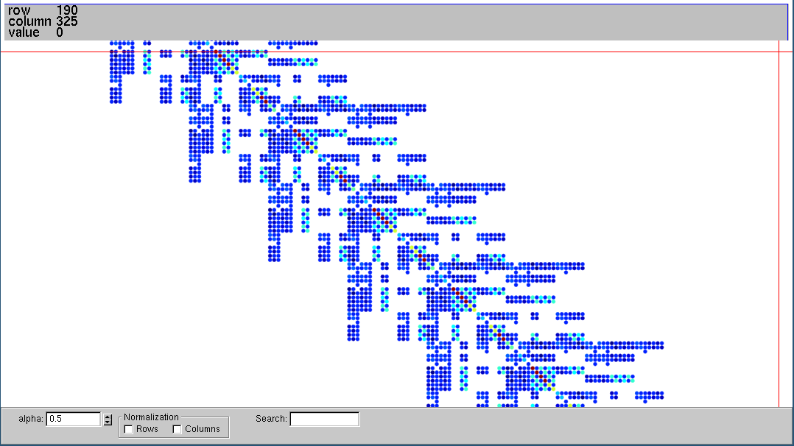
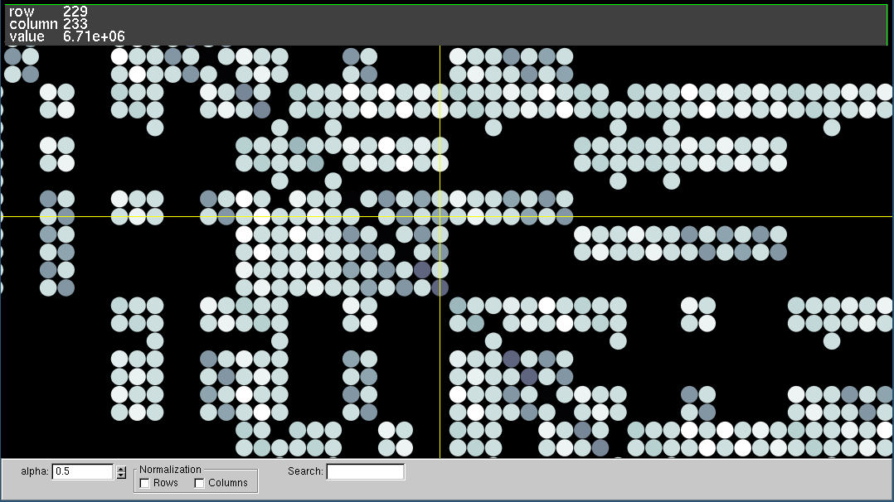
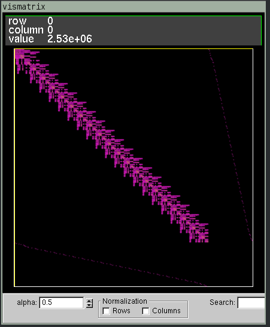

# Vismatrix &ndash; Visualization of sparse matrices






Vismatrix is a nice tool to visualize sparse matrices in (.smat) format

## Acknowledgements

To [Professor David Gleich](https://github.com/dgleich) for this wonderful tool.

## License

```
------------------------------------------------------------
vismatrix 2.0 
------------------------------------------------------------
Copyright David Gleich, Leonid Zhukov, 2006-2007.
```

Unless otherwise noted, the source files are distributed under the BSD-style license found in the
LICENSE file.

See also LICENSE files in each one of the subdirectories 'boost', 'glui', and 'tclap'.

## Installation

**1** Install dependencies (tested on `Ubuntu 20.04.1 LTS`):
```
sudo apt-get install freeglut3-dev libxmu-dev libxi-dev libz-dev g++ make cmake
```

**2** Download the code into `/tmp/vismatrix`:
```
git clone --depth 1 https://github.com/cpmech/vismatrix.git /tmp/vismatrix
```

**3** Compile the code:
```
cd /tmp/vismatrix/src
cmake -Wno-dev .
make
```

**4** The executable file will be `/tmp/vismatrix/src/vismatrix` and you may install into `/usr/local/bin` by using:
```
sudo make install
```

## Usage

The matrix input file is quite simple (0-index based):
```
m n nnz
i j x
...
i j x
```
where the first line has `m` as the number of rows, `n` as the number of columns, and `nnz` as the number of non-zero values. The following lines contain the index of row `i` and column `j` of the non-zero entry `x`.

See [example.smat](https://github.com/cpmech/vismatrix/blob/master/example.smat) file.

Usage:
```
vismatrix /tmp/vismatrix/example.smat
```

Some commands:
- mouse move: pan
- shift + mouse: zoom
- control + click: inspect value
- right-click: options




