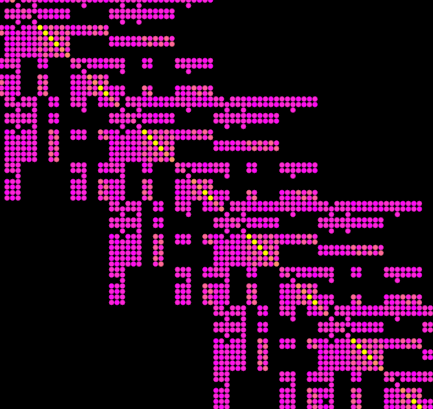

# Vismatrix &ndash; Visualization of sparse matrices

Vismatrix is a nice tool to visualize sparse matrices in (.smat) format

<div id="container">
<p></p>
<p></p>
</div>

## License

Unless otherwise noted, the source files are distributed under the BSD-style license found in the
LICENSE file.

See also LICENSE files in each one of the subdirectories 'boost', 'glui', and 'tclap'.

## Acknowledgements

To Professor David Gleich for this wonderful tool.

## Installation

Download vismatrix into **~/pkg/vismatrix**

In Ubuntu/Debian:
```
sudo apt-get install freeglut3-dev libxmu-dev libxi-dev

mkdir -p ~/pkg/build_vismatrix
cd ~/pkg/build_vismatrix
ccmake ~/pkg/vismatrix
[c] [c] [g]
make
sudo make install
```
